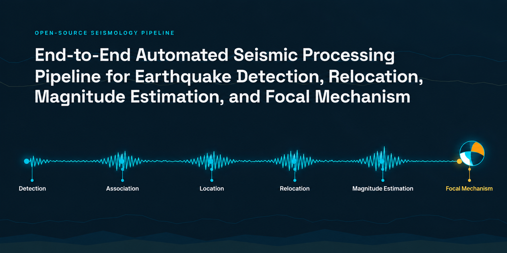
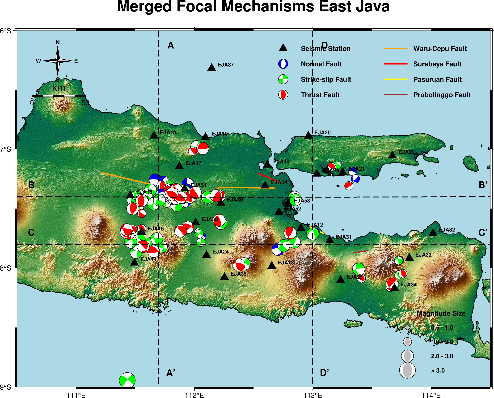

# End-to-End Automated Seismic Processing Pipeline

Automated seismic processing pipeline for the East Java ("Jatim") seismic
network (network code `3M`, 27 broadband stations `EJA12`…`EJA4x`) — from raw
continuous waveform data to a quality-controlled, relocated, magnitude-graded
earthquake catalogue.

The pipeline takes daily raw miniSEED files per station and produces:
phase picks (P/S arrivals), associated discrete earthquake events, absolute
hypocentre locations, double-difference relative relocations, and local
magnitudes — plus diagnostic plots at every stage.

It is a batch research pipeline, not a software package: there is no CI, no
test suite, and every stage is a standalone script driven entirely by one
shared config file. Runs span months of continuous data and take hours to
days, so every stage is checkpoint/resume-based.

## Pipeline stages

| # | Stage | Script | Conda env | Output |
|---|-------|--------|-----------|--------|
| 0 | Preprocessing | `scripts/prepro.py` | `pyocto` | `output/preprocessing/` |
| 1 | Phase picking | `scripts/pick.py` | `obspy` | `output/picking/` |
| 2 | Association | `scripts/association.py` | `pyocto` | `output/association/` |
| 3 | Location | `scripts/locator.py` | `pyocto` | `output/hypocenter_locator/` |
| 4 | Relocation | `scripts/relocation.py` | `pyocto` | `output/relocation/` |
| 5 | Magnitude | `scripts/magnitud.py` | `pyocto` | `output/magnitud/` |
| 6 | Focal Mechanism | `scripts/focmech.py` | `pyocto` | `output/focal_mechanism/` |

```
AusPass_Jatim/<date>/<date>_<STA>_<CH>.mseed   (raw input, one file per channel)
        │
        ▼  prepro.py        merge channels → detrend/demean → resample → bandpass
output/preprocessing/<date>/<NET>.<STA>..<date>.mseed
        │
        ▼  pick.py           EQTransformer (SeisBench) phase picking
output/picking/summary/ALL_results_combined.csv
        │
        ▼  association.py    PyOcto association → QC-0…QC-4 → per-event plots
output/association/csv/pyoctorev_{assignments,catalog}.csv
output/association/nonlinloc/picks/*.pick
        │
        ▼  locator.py         NonLinLoc (Vel2Grid → Grid2Time → NLLoc)
output/hypocenter_locator/csv/hypocenter_catalog.csv
        │
        ▼  relocation.py      double-difference relocation (hypoDD via relocDD-py)
output/relocation/relocated_catalog.csv
        │
        ▼  magnitud.py        Wood-Anderson local magnitude (ML) + event/magnitude map
output/magnitud/csv/ml_event_magnitudes.csv
        │
        ▼  focmech.py         FocONet focal mechanism estimation + Kagan angle pairing
output/focal_mechanism/focal_mechanisms.csv
output/focal_mechanism/kagan_pairs.csv
output/focal_mechanism/plots/*.png
```

1. **Preprocessing** (`prepro.py`) — merges per-channel raw files into 3-component
   streams, detrends/demeans, anti-alias low-passes, resamples to a common
   rate, and bandpass filters. Runs per station-day, in parallel.
2. **Picking** (`pick.py`) — runs the EQTransformer deep-learning model (via
   SeisBench, `stead` weights) over each preprocessed station-day to detect
   P/S phase arrivals, and writes a STEAD-style detections CSV plus
   diagnostic plots.
3. **Association** (`association.py`) — associates picks across stations into
   discrete earthquake events with PyOcto, applies a five-stage QC pipeline
   (QC-0…QC-4: duplicate/single-station pruning, Ts−Tp bounds, pseudo-distance
   triangle-inequality check, Wadati slope check, origin-time consistency),
   and writes NonLinLoc-ready `.pick` files plus per-event diagnostic plots.
4. **Location** (`locator.py`) — drives the NonLinLoc binaries (`Vel2Grid` →
   `Grid2Time` → `NLLoc`) over the associated picks to get absolute
   hypocentres, parses `.hyp` output into a catalogue, and grades each
   solution against catalogue-median QC thresholds.
5. **Relocation** (`relocation.py`) — refines hypocentres *relative to each
   other* with the double-difference method (hypoDD, via the vendored
   [relocDD-py](https://github.com/katie-biegel/relocDD-py)), combining
   catalogue differential times (`ph2dt`) with waveform cross-correlation
   differential times.
6. **Magnitude** (`magnitud.py`) — measures Wood-Anderson peak-to-peak
   amplitude near each S pick, computes per-station local magnitude (Hutton &
   Boore, 1987) and the event ML (median over stations), and renders the final
   deliverable event/magnitude map (PyGMT).
7. **Focal Mechanism** (`focmech.py`) — runs the FocONet deep-learning model to
   estimate focal mechanisms (strike, dip, rake) directly from 3-component
   waveforms for relocated events. Computes Kagan angles between all event pairs
   and plots focal mechanisms (beachballs).

See `CLAUDE.md` for the full architecture reference (per-stage config keys,
derived-parameter formulas, QC rationale) and `ASSOCIATION_QC.md` for a
narrative walkthrough of the association → QC → catalogue chain.

## Configuration

Every stage is controlled by one shared file, `config/config.yaml` — no
script has CLI flags, and no script needs to be edited for a parameter
change. Each script loads its own top-level section by the same key as its
stage name (`preprocessing:`, `picking:`, `association:`, `hypocenter_locator:`,
`relocation:`, `magnitud:`, `focal_mechanism:`), plus a shared top-level `network:` code.

Two things are notable about how it works:

- **Most association/location geometry is auto-derived from `stations.txt`**,
  not hand-tuned — network aperture, search radius, velocity tolerance, QC
  bounds, etc. are all computed from actual station geometry so the pipeline
  self-adapts to a different network. Only a small number of true physical
  free parameters (P velocity, Vp/Vs ratio, pick-error tolerance) are set
  directly; everything else that can be derived, is. See `CLAUDE.md`'s
  "Association" section for the full derivation table.
- **The velocity model is defined once**, in `config/vel_model/jatim_velocity_model.txt`
  (NonLinLoc `LAYER` format), and both `locator.py` and `relocation.py` parse
  it at load time instead of keeping two independent copies of the same
  numbers in the YAML.

To adapt this pipeline to a different network: replace `stations.txt` (4
whitespace-delimited columns — station, latitude, longitude, elevation_m),
update `network:` in `config/config.yaml`, drop in a new velocity model
under `config/vel_model/`, and point each stage's `*_folder`/`*_dir` paths at
your own data locations.

## Install

```bash
python -m venv .venv && source .venv/bin/activate
pip install -r requirements.txt
```

One venv covers every stage — `requirements.txt` is a single pinned list.
Then drive everything through the central control script, which runs each
stage as a subprocess of `.venv`'s own interpreter:

```bash
python pipeline.py                    # interactive menu
python pipeline.py --list             # list available steps
python pipeline.py prepro picking     # run these steps, in the order given
python pipeline.py --all              # run every step, in pipeline order
```

`pipeline.py` auto-detects `.venv/` at the project root and uses it for
every stage when present; on the machine this pipeline was developed on it
instead falls back to two pre-existing conda environments (`pyocto` and
`obspy` — see `CLAUDE.md`) kept from before the single-venv setup was
validated. Either works; you don't need conda.

Additional non-pip dependencies:

- **NonLinLoc** binaries (`Vel2Grid`, `Grid2Time`, `NLLoc`) — build from
  [source](https://github.com/ut-beg-texnet/NonLinLoc) and put on `PATH`.
- **relocDD-py** — not a pip package; clone
  [katie-biegel/relocDD-py](https://github.com/katie-biegel/relocDD-py) into
  the path pointed to by `relocation.relocdd_py_dir` in `config/config.yaml`
  (default: `output/relocation/relocDD-py/`).
- **PyGMT** additionally needs the [GMT](https://www.generic-mapping-tools.org/)
  C library installed system-wide (`sudo apt install gmt` or
  `conda install -c conda-forge gmt`) — it isn't on PyPI, so plain `pip
  install pygmt` only works once `gmt` is discoverable on the system.
  `locator.py`'s and `magnitud.py`'s map figures download topography tiles on
  first use and need network access.
- **torch**, installed from `requirements.txt` as-is, pulls a CPU build. For
  the CUDA 12.1 build this pipeline was validated on (`pick.py`'s EQTransformer
  inference), install it separately first:
  `pip install torch==2.5.1 --index-url https://download.pytorch.org/whl/cu121`.
- EQTransformer model weights are downloaded automatically by SeisBench on
  first use.

## Repository layout

```
config/
  config.yaml                  # all tunable parameters (single source of truth)
  vel_model/                   # NonLinLoc-format velocity model
scripts/                       # one script per pipeline stage
  prepro.py  pick.py  association.py  locator.py  relocation.py  magnitud.py  focmech.py
pipeline.py                    # central control script / interactive menu
stations.txt                   # station metadata (station, lat, lon, elevation_m)
output/                        # all run artefacts, one subfolder per stage (gitignored)
picking.ipynb, association/*.ipynb   # earlier notebook iterations (superseded, stale paths)
CLAUDE.md                      # full architecture reference
ASSOCIATION_QC.md              # narrative explanation of association -> QC -> catalogue
requirements.txt               # every stage's Python dependencies, one pinned list
```

## License & citation

Code in this repository is released under the [MIT License](LICENSE).

`relocDD-py` (vendored separately, not included in this repo) carries its
own license — see its own `LICENSE.txt`.

If this pipeline or its catalogue contributes to published work, please cite
the underlying tools:

- **EQTransformer** — S. M. Mousavi et al. (2020), *Earthquake transformer—an
  attentive deep-learning model for simultaneous earthquake detection and
  phase picking*, Nature Communications.
- **SeisBench** — J. Woollam et al. (2022), *SeisBench—A toolbox for machine
  learning in seismology*, Seismological Research Letters.
- **PyOcto** — J. Münchmeyer (2024), *PyOcto: A high-throughput seismic phase
  associator*, Seismica.
- **NonLinLoc** — A. Lomax, A. Michelini, A. Curtis (2000), *Earthquake
  location, direct, global-search methods*, in Encyclopedia of Complexity and
  System Science.
- **hypoDD / relocDD-py double-difference relocation** — F. Waldhauser & W. L.
  Ellsworth (2000), *A double-difference earthquake location algorithm:
  Method and application to the northern Hayward fault*, BSSA; K. Biegel et
  al., [relocDD-py](https://github.com/katie-biegel/relocDD-py).
- **Local magnitude (Wood-Anderson / ML)** — L. K. Hutton & D. M. Boore
  (1987), *The ML scale in southern California*, BSSA.
- **ObsPy** — M. Beyreuther et al. (2010), *ObsPy: A Python toolbox for
  seismology*, Seismological Research Letters.

## Results


